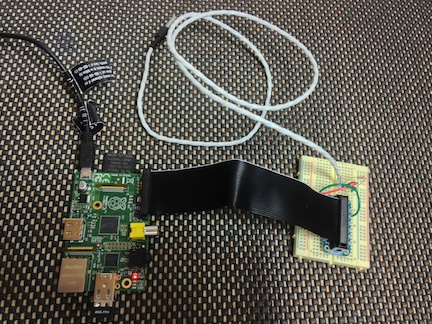

ds18b20-monitor
===============

Overview
--------

ds18b20-monitor is a personal electronics project used to monitor temperature and send SMS notifications when the temperature falls below a lower limit or reaches an upper limit. I am personally using the device to monitor the temperature of my smoker and to alert me when the temperature inside the smoker goes below 205 degrees F or above 240 - the ideal temperature range to smoke a beef brisket. My briskets take about 16 hours, so I can start the brisket when I go to bed and let my phone tell me if I need to get up to adjust the temperature of the smoker.

The hardware device consists of a Raspberry Pi model B with a miniature Wifi module and a breadboard with a circuit containing the temperature sensor, the ds18b20. The circuit is connected to the Pi's GPIO.

The software on the Pi is a simple Groovy script with a configuration file for setting properties such as upper and lower temperature limits and SMS account information. (I chose Groovy because I'm a Java and Groovy developer by day and it's a language that I'm comfortable with.) The script could easily be ported to Python, bash or any other language.) The SMS notifications are delegated to [Twilio](http://www.twilio.com) via HTTP post, so a Twilio account is also needed to build and use this project. A Twilio account is free and can be upgraded to remove Twilio's marketing message from the SMS messages.

Keep in mind that this project is in its infancy and is therefore very crude and just about all of the setup is a manual process. I may or may not continue to tinker with the project depending on how useful it is to me in its current state.

Some experience with Linux is assumed. I've tried not to be too verbose in these instructions

Parts List
----------

This is the complete list of Pi and circuit parts needed to assemble the project. I have included links to the items on Adafruit or Radio Shack for reference and convenience, but most of the items can be found at any local electronics store.

* Raspberry Pi Model B ([http://www.adafruit.com/products/998](http://www.adafruit.com/products/998))
* Power Cable and SD Card for Pi (or a nice [starter kit](http://www.adafruit.com/products/955) that includes nearly all the items in this list)
* Miniature WiFi (802.11b/g/n) Module ([http://www.adafruit.com/products/814](http://www.adafruit.com/products/814))
* Pi Cobbler Breakout and Cable ([http://www.adafruit.com/products/914](http://www.adafruit.com/products/914))
* Half-Size Breadboard ([http://www.adafruit.com/products/64](http://www.adafruit.com/products/64))
* Jumper Wire ([http://www.adafruit.com/products/153](http://www.adafruit.com/products/153))
* One 4.7K or 10K Ohm Resistor ([http://www.radioshack.com/product/index.jsp?productId=2062347](http://www.radioshack.com/product/index.jsp?productId=2062347))
* One DS18B20 Temperature Sensor (The ones linked below come with the resistor listed above.)
	* Basic ([http://www.adafruit.com/products/374](http://www.adafruit.com/products/374))
	* Waterproof ([http://www.adafruit.com/products/381](http://www.adafruit.com/products/381))
	* High Temperature and Waterproof ([http://www.adafruit.com/products/642](http://www.adafruit.com/products/642))

Building And Configuring the Device
-----------------------------------

This section addresses all the steps needed to build and configure the device, and install and configure the monitoring software.

###Create a Twilio Account###

Create a free/trial account a twilio.com. Make note of the phone number, account SID and authorization token. These properties will be used later when configuring the monitor script.

###Circuit Assembly###

###Pi Configuration###

####OS####

The choice of *which* OS to install is not too extremely important; any OS will support the hardware and software used in this project. A recent version of Debian Wheezy installed from NOOBS is a safe bet because it supports the Wifi module listed above out of the box. The details of installing the OS onto the Pi is beyond the scope of this document, but it is not difficult. Reference the [Raspberry Pi Quick Start Guide](http://www.raspberrypi.org/quick-start-guide) for OS installation instructions. The rest of this document assumes that Wheezy 7.* was installed.

####Network####

To configure the network interface, start the Pi *with the module unplugged*, log into the Pi and edit the `/etc/network/interfaces` file. The file should look like the template below, but with the SSID and password of your network.

	auto lo

	iface lo inet loopback
	iface eth0 inet dhcp

	auto wlan0
	allow-hotplug wlan0
	iface wlan0 inet dhcp
		wpa-ssid "Your Network SSID"
		wpa-psk "Your Network Password"
		
Reboot the Pi. After startup, the Pi should be connected to the network. Ping google.com to verify.

Execute `ifconfig` from the command line and make note of the IP address assigned to the wlan0 interface. This is the IP address of the Pi and you will need it.

####Java JDK####

Wheezy 7.* comes with a JDK installed. Verify by executing `java -version` at the command line. If the java command is not found, the easiest way to install a JDK is by executing `sudo apt-get install openjdk-7-jdk`.

####Groovy####

Install Groovy by executing `sudo apt-get install groovy`. Verify the installation by executing `groovy -v`. Be patient while waiting for the output. It can take 5-10 seconds. Groovy startup seems to be slow on the Pi with Wheezy.

####Monitor Software Installation and Configuration####

There are two files in this repository that are used: `src/Monitor.groovy` and `conf/config.groovy`. Copy these files to any location on the Pi, a subdirectory of your home directory is fine. 
Alternatively, if git is installed on the Pi (it is by default in Wheezy 7.*), executing `git clone https://github.com/mmunhall/ds18b20-monitor.git` will clone the entire project, including this README, into a subdirectory called dsb1820-monitor. This is probably easier than downloading the files and using `scp` or FTP to then move the files.

`Monitor.groovy` is the script that queries the temperature sensor and sends SMS notifications. `config.groovy` contains the configuration parameters that are used by `Monitor.groovy`. Open `config.groovy` and review each configuration parameter. Each parameter is commented well enough to determine how it is used, so detailed explanations are not provided here. The most important paramters to change are the ones related to the SMS service. Set the value of those parameters to match your Twilio account information.

###Usage###

